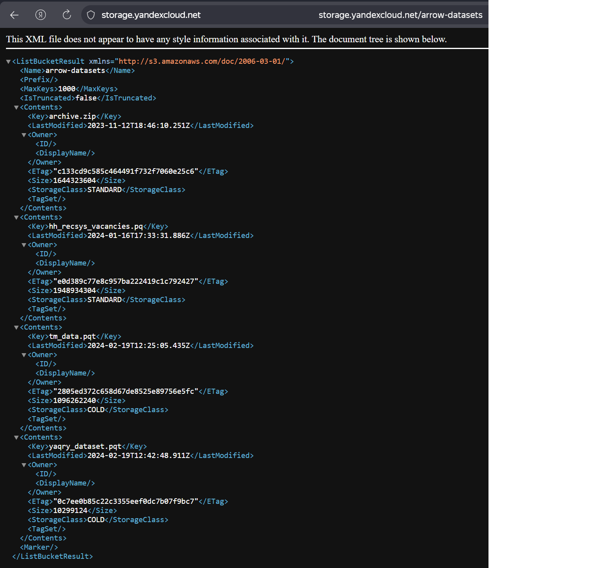
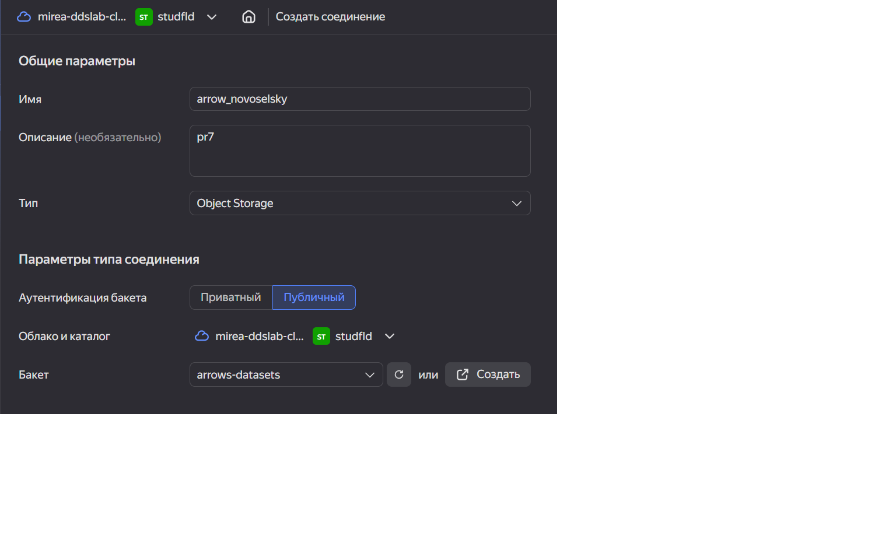
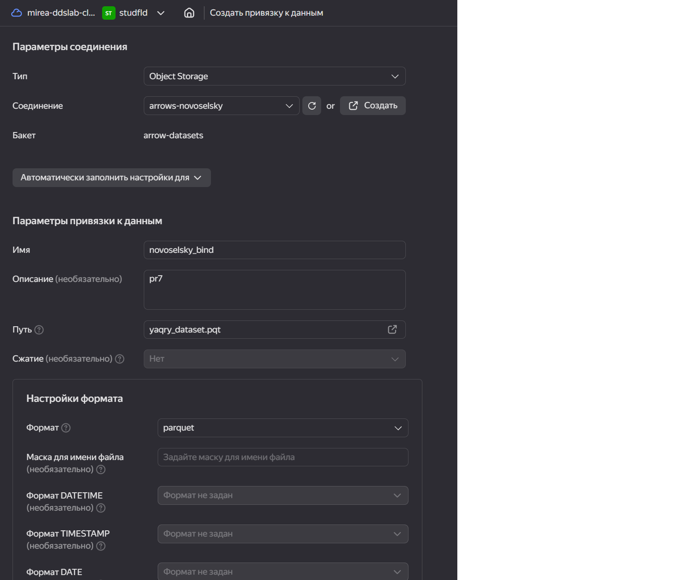
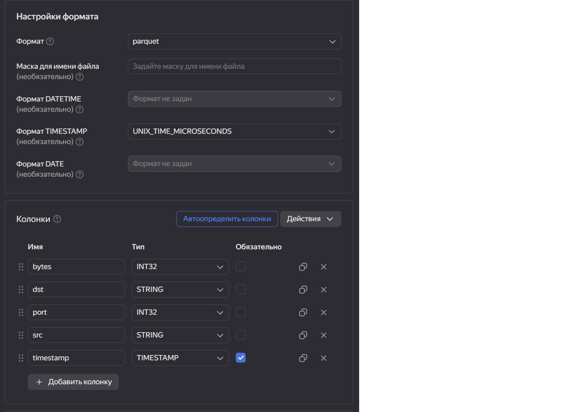
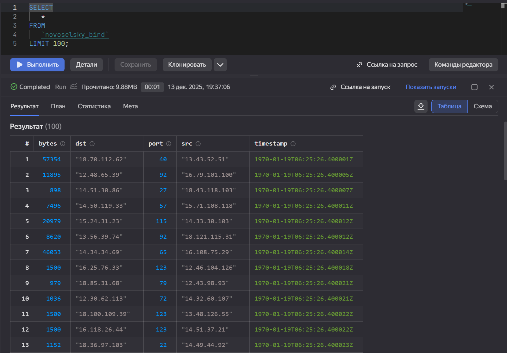
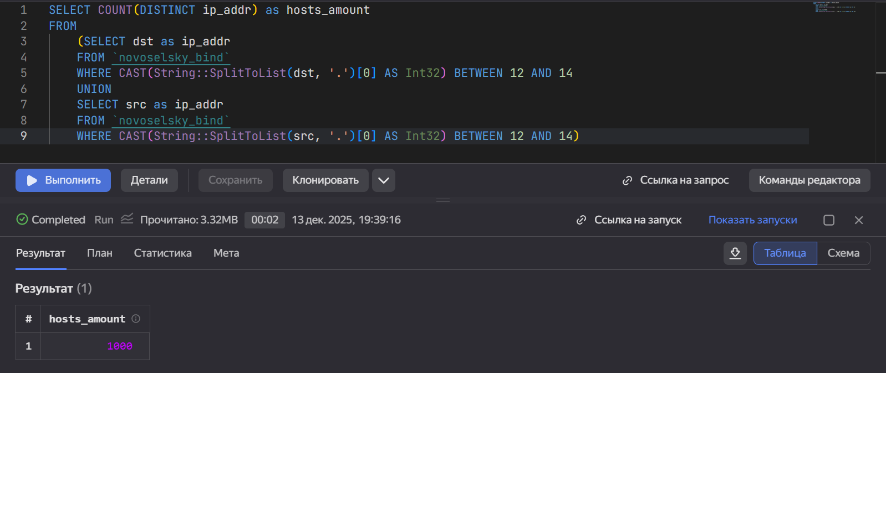
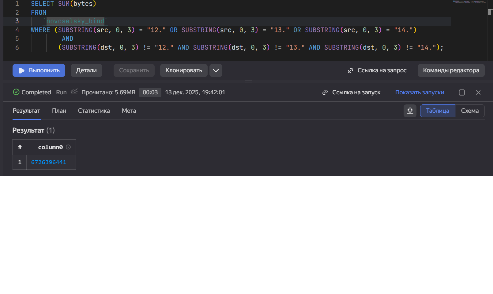
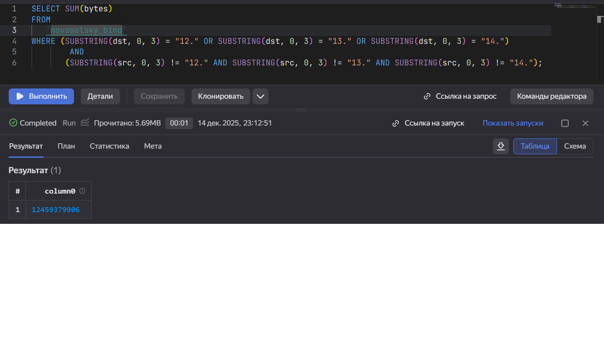

##Цель работы
1. Изучить возможности технологии Yandex Query для анализа структурированных
наборов данных
2. Получить навыки построения аналитического пайплайна для анализа данных с
помощью сервисов Yandex Cloud
3. Закрепить практические навыки использования SQL для анализа данных сетевой
активности в сегментированной корпоративной сети

## Исходные данные

1. Программное обеспечение Windows 11
2. Rstudio Desktop
3. Данные сетевой активности в корпоративной сети компании XYZ, хранящиеся в `Yandex Object Storage`
4. Сервисы `Yandex Cloud`

## Задание

  Используя сервис `Yandex Query` настроить доступ к данным, хранящимся в сервисе хранения данных `Yandex Object Storage`. При помощи соответствующих SQL запросов ответить на вопросы.

## Ход работы

1.  Проверить доступность данных в `Yandex Object Storage`
2.  Подключить бакет как источник данных для `Yandex Query`
3. Известно, что IP адреса внутренней сети начинаются с октетов, принадлежащих интервалу [12-14]. Определить количество хостов внутренней сети, представленных в датасете.
4. Определить суммарный объем исходящего трафика
5. Определить суммарный объем входящего трафика
6. Оформление отчета


## Шаги

### 1. Проверить доступность данных в Yandex Object Storage


### 2. Подключить бакет как источник данных для Yandex Query

#### 2.1-2.2 Создать соединение для бакета в S3 хранилище и заполнить поля.

#### 2.3-2.4 Создать привязку данных

####Настроить формат данных для созданной привязки:

#### 2.5 Проверка подключения

Выполним простой запрос:
```sql
SELECT
   *
FROM
   `novoselsky_bind`
LIMIT 100;
```

### 3. Анализ

#### 3.1 Известно, что IP адреса внутренней сети начинаются с октетов, принадлежащих интервалу \[12-14\]. Определите количество хостов внутренней сети, представленных в датасете

Воспользуемся функцией `String::SplitToList`, чтобы разбить адрес в виде строки на список строк с разделителем `.`, применим функцию к `dst` и к `src` и выберем количество уникальных адресов.

```sql
SELECT COUNT(DISTINCT ip_addr) as hosts_amount
FROM
    (SELECT dst as ip_addr
    FROM `novoselsky_bind`
    WHERE CAST(String::SplitToList(dst, '.')[0] AS Int32) BETWEEN 12 AND 14
    UNION
    SELECT src as ip_addr
    FROM `novoselsky_bind`
    WHERE CAST(String::SplitToList(src, '.')[0] AS Int32) BETWEEN 12 AND 14)
```   

   
 Полученный результат - 1000 хостов в датасете

#### 3.2. Определите суммарный объем исходящего трафика

```sql    
SELECT SUM(bytes)
FROM 
   `novoselsky_bind`
WHERE (SUBSTRING(src, 0, 3) = "12." OR SUBSTRING(src, 0, 3) = "13." OR SUBSTRING(src, 0, 3) = "14.")
        AND
       (SUBSTRING(dst, 0, 3) != "12." AND SUBSTRING(dst, 0, 3) != "13." AND SUBSTRING(dst, 0, 3) != "14.");
```
 
#### 3.3. Определите суммарный объем входящего трафика

Необходимо поменять `dst` и `src` местами(обратная задача к пункту 3.2):

```sql
 SELECT SUM(bytes)
FROM 
   `novoselsky_bind`
WHERE (SUBSTRING(dst, 0, 3) = "12." OR SUBSTRING(dst, 0, 3) = "13." OR SUBSTRING(dst, 0, 3) = "14.")
        AND
       (SUBSTRING(src, 0, 3) != "12." AND SUBSTRING(src, 0, 3) != "13." AND SUBSTRING(src, 0, 3) != "14.");
```       
 
       
## Вывод

 Таким образом, с использованием сервиса Yandex Query был настроен доступ к данным, размещённым в Yandex Object Storage, что позволило на практике закрепить навыки применения SQL для анализа данных сетевой активности в корпоративной сети.      


