# Использование технологии Yandex DataLens для анализа данных сетевой
активности
dimaa.04ru@yandex.ru

## Цель работы

1.  Изучить возможности технологии `Yandex DataLens` для визуального
    анализаструктурированных наборов данных
2.  Получить навыки визуализации данных для последующего анализа с
    помощьюсервисов `Yandex Cloud`
3.  Получить навыки создания решений мониторинга/SIEM на базе облачных
    продуктов и открытых программных решений
4.  Закрепить практические навыки использования SQL для анализа данных
    сетевойактивности в сегментированной корпоративной сети

## Задачи

1.  Представить в виде круговой диаграммы соотношение внешнего и
    внутреннего сетевого трафика.
2.  Представить в виде столбчатой диаграммы соотношение входящего и
    исходящего трафика из внутреннего сетвого сегмента.
3.  Построить график активности (линейная диаграмма) объема трафика во
    времени.
4.  Все построенные графики вывести в виде единого дашборда в
    `Yandex DataLens`.

## Исходные данные

1.  Программное обеспечение Windows 11
2.  Rstudio Desktop
3.  Данные сетевой активности в корпоративной сети компании XYZ,
    хранящиеся в `Yandex Object Storage`
4.  Сервисы `Yandex Cloud`

## Задание

Используя сервис `Yandex DataLens` настроить доступ к `Yandex Query`,
который мы использовали в ходе ранее выполненных практических работ, и
визуально представить результаты анализа данных.

## Ход работы

1.  Настроить подключение к `Yandex Query` из `DataLens`
2.  Создать из запроса `YandexQuery` датасет `DataLens`
3.  Сделать нужные графики и диаграммы
4.  Составить дашборд
5.  Оформление отчета

## Шаги

### 1. Настроить подключение к Yandex Query из DataLens

#### 1.1. Перейти в соответствующий сервиc

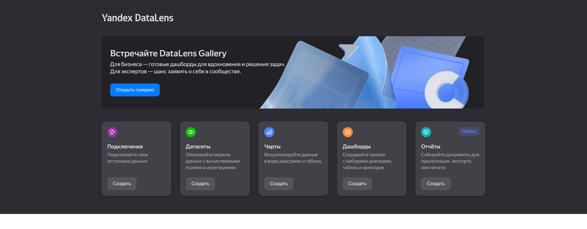 \#### 1.2. Создание подключения

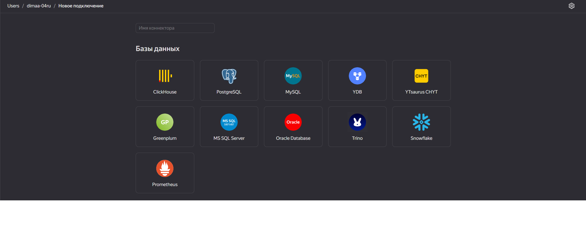

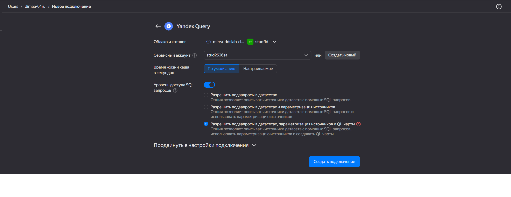

### 2. Создать из запроса YandexQuery датасет DataLens

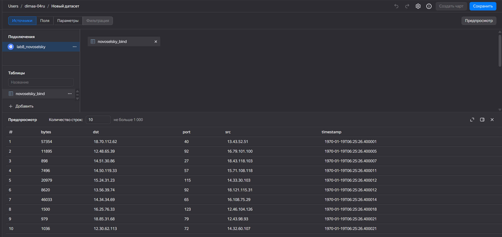

### 3. Создание чартов

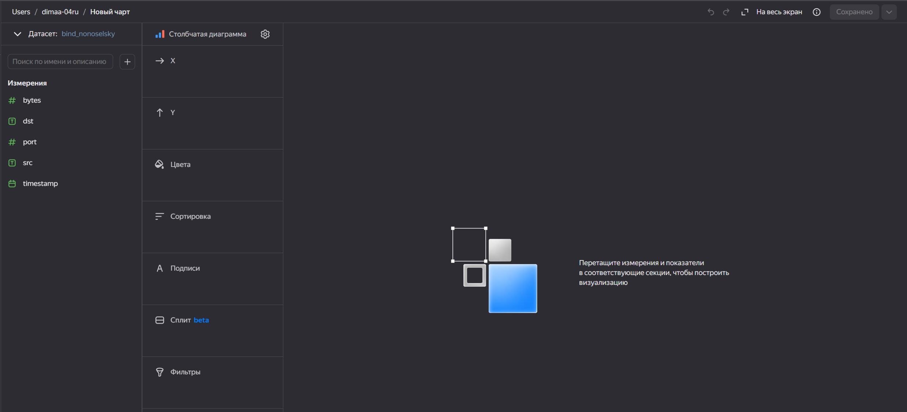

#### 3.1. Представить в виде круговой диаграммы соотношение внешнего и внутреннего сетевого трафика.

Создадим вычисляемое поле, назовем его `in-out`, для того чтобы
отобразить разделение сетевого трафика на внутренний и внешний.
SQL-запрос представлен на рисунке:

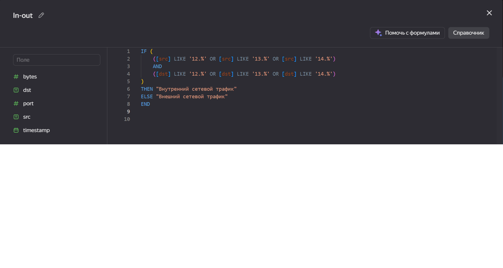 Получим следующую круговую диаграмму:

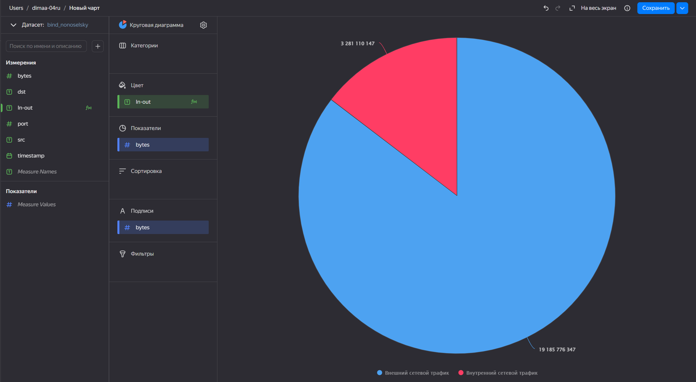

#### 3.2. Представить в виде столбчатой диаграммы соотношение входящего и исходящего трафика из внутреннего сетевого сегмента.

Также как и в пункте 3.1 создадим поле `in-out`, для столбчатой
диаграммы:

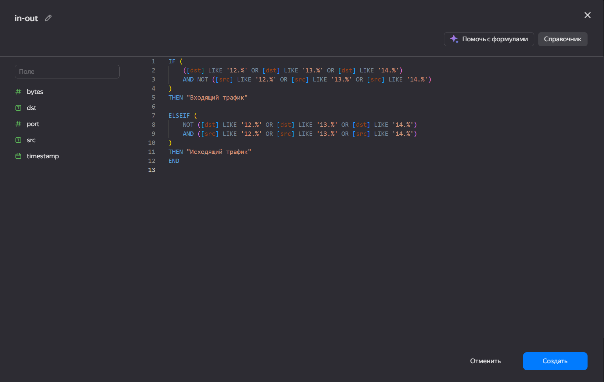

По Оси X разместим поле `in-out`, по оси Y `bytes`, в качестве Цвета
укажем `in-out`, а в качестве подписи `bytes`, получим следующую
столбчатую диаграмму:

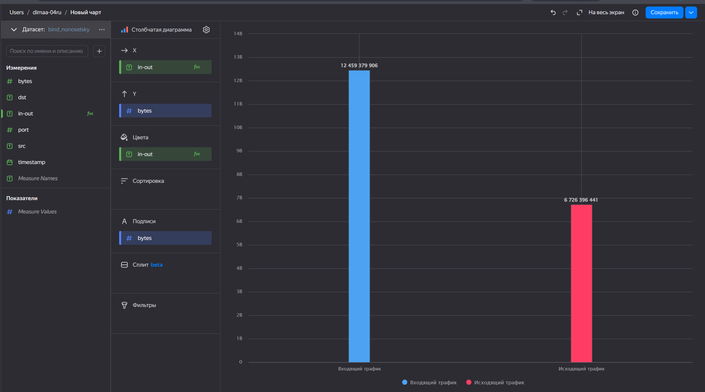

#### 3.3. Построить график активности (линейная диаграмма) объема трафика во времени.

Из-за того, что изменение времени происходит на уровне миллисекунд, то
придется преобразовать поле, отвечающее за него. Используем следующее
преобразование времени:

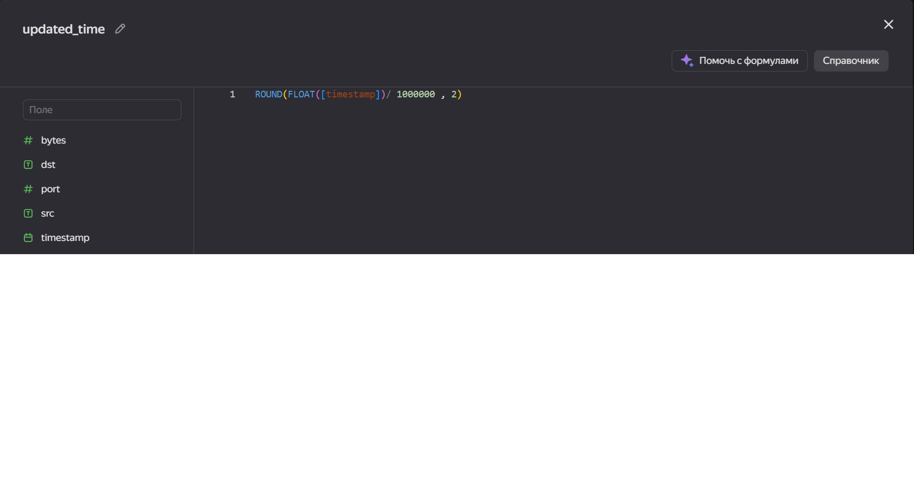

Получим следующую линейную диаграмму:

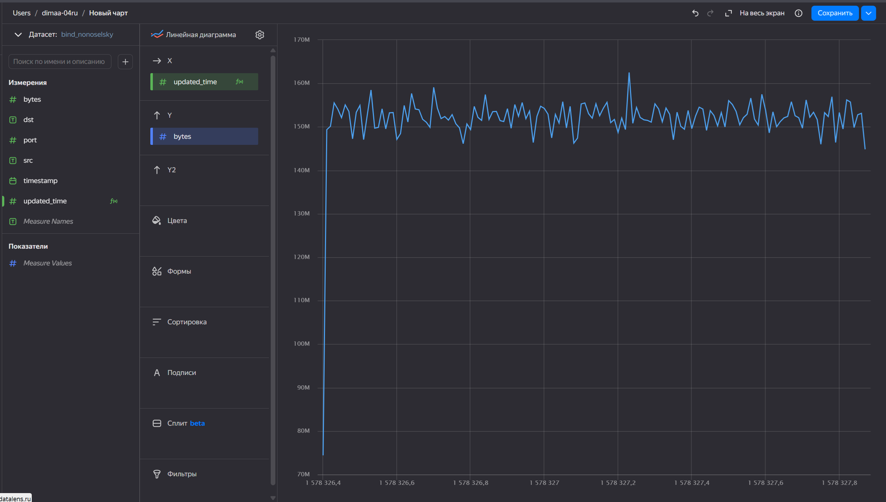

### 4. Составляем дашборд

Далее, все полученные чарты объединяем в единый дашборт

Итоговый дашборд:

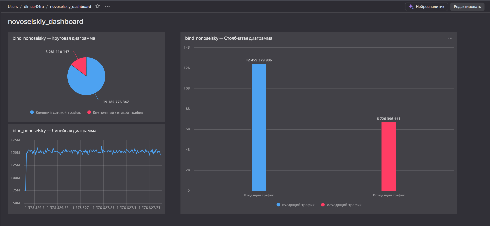

[Ссылка на итоговый
дашборд](https://datalens.ru/yik9u1j33j6wi-novoselskiy-dashboard)

## Вывод

В данной практической работе, используя сервис `Yandex DataLens`, мы
настроили доступ к `Yandex Query`, который мы использовали в ходе ранее
выполненных практических работ, и визуально представили результаты
анализа данных.
